추천시스템 페이지를 만드는 중 별점이 이상하게 표시되는 현상이 있었다... 책 Do it! 인터랙티브 웹 페이지 만들기에 나오는 템플릿 그대로 사용하다보니 이런 문제가 생겨도 해결하지 못하여 CSS 완전 쌩기초부터
정리해보려한다.


위 사진의 html코드는 다음과 같다.

```html

<body>
<main>
    <section>
        
        <article class='pop'>
            <div>
                
                <h2>{{ r.title }}</h2>
                <p>{{ r.genres }}</p>
                ★★★★★
                <span class="rating_star">★★★★★</span>
                <input type="range" value="1" step="1" min="0" max="10">
            </div>
        </article>
        
    </section>
</main>
</body>
```

배경이 되는 회색 별은 <p>태그 바로 아래의 별 다섯개이고, 노란색으로 채워지는 별은 span.rating_star태그이다.
CSS 코드를 여기 적기엔 너무 길기 때문에 CSS를 공부하면서 왜 저렇게 되는지 알아보자..

아참 위 html 코드의 출처는 [[JavaScript] 별점 드래그 기능 만들기](https://stickode.tistory.com/639)이다. (감사합니다ㅠ)


---

### 전체 선택자

```css
* {
    border: 1px solid red;
}
```

body 태그를 포함해 태그 전체를 선택할 수 있다.

### 태그 선택자

특정 태그를 선택한다.

```css
h1 {
    border: 1px solid red;
}

h2 {
    border: 1px solid blue;
}
```

### 자손 선택자

자식과 하위요소를 포함해 그 하위에 있는 모든 요소를 선택한다.

```css
p strong {
    border: 1px solid blue;
}
```

### 자식 선택자

직계 자식요소만 선택한다.

```css
ul > li {
    border: 1px solid blue;
}
```

### 속성 선택자

아래와 같은 HTML이 있다고 하자.

```html

<body>
<form>
    <input type="text">
    <input type="password">
</form>
</body>
```

form 태그 안에 input 태그를 2개 작성하고 type 속성을 각각 지정하자.

```css
input[type="text"] {
    border: 1px solid blue;
}

input[type="password"] {
    border: 1px solid red;
}
```

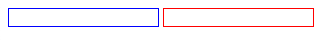

그럼 결과는 다음과 같다. input 태그의 type 속성마다 각각 적용된다.

### 가상 선택자

가상 선택자(virtual selector)는 특정 조건이 충족될 때 실행되도록 한다. 예를 들어 다음과 같은 HTML과 CSS가 있다고 하자.

```html

<body>
<h1>HELLO</h1>
</body>
```

```css
h1 {
    border: 1px solid blue;
}

h1:hover {
    border: 2px dashed red;
}
```

두번째 요소에는 h1에 :hover라는 가상 선택자를 붙였다.

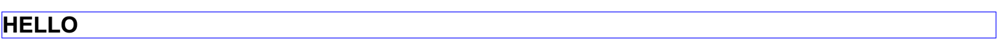

마우스를 올려놓기 전엔 파란색 solid 선이다.

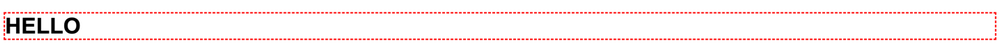

마우스를 올려놓으면 빨간색 dashed 선으로 바뀐다.

이번엔 가상선택자 :before와 :after에 대해 알아보자.

```css
h1:before {
    content: "before content";
    color: blue;
}

h1:after {
    content: "after content";
    color: red;
}
```

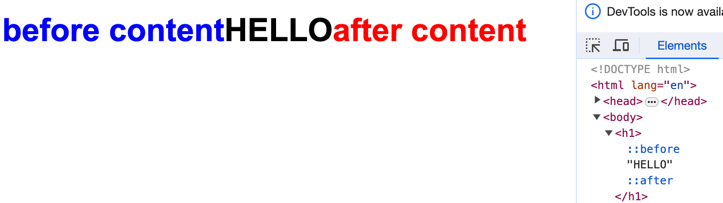

그림처럼 :before와 :after는 'content'에 입력한 글자가 HELLO 앞뒤에 나타난다. 개발자도구에서 확인해보면 ::before와 ::after라는 가상의 요소가 생성되었다. HTML 파일에 입력하지
않아도 CSS파일에서 입력한 콘텐츠가 생기는 것이다.

### 클래스 선택자와 아이디 선택자

는 각각 .과 #를 사용하면 되니 넘어가자.

### 폰트 굵기

normal과 bold 두 가지가 있다.

```css
h1 {
    font-weight: normal; /*h1의 기본 굵기를 제거하고 normal을 적용한다.*/
}

p span {
    font-weight: bold;
}
```

### 폰트 크기 바꾸기

웹페이지는 보통 픽셀로 구성되기 때문에 px를 주로 쓰지만 가끔 rem이나 em을 쓴다.
rem은 최상위 부모인 <html>태그를 기준으로 폰트 크기를 설정한다. em은 부모 요소를 기준으로 폰트 크기를 설정한다.

픽셀은 다음과 같이 숫자로 설정한다.

```css
articel h1 {
    font-size: 60px;
}
```

rem 사용할 땐 다음과 같다.

```css
html {
    font-size: 16px;
}

article h1 {
    font-size: 3rem;
}
```

최상위 요소인 html의 폰트 크기를 16px로 설정하고 h1태그는 3rem으로 설정했다. 즉 html요소 기준으로 3배 키우라는 뜻이다.

rem이 나온 후 em은 잘 쓰지 않는다고 한다. 부모태그 기준으로 설정된다.

### 폰트 모양 바꾸기

font-family 속성을 사용한다.

```html

<body>
<ul>
    <li>FONT FAMILY</li>
    <li>Serif</li>
</ul>
</body>
```

```css
ul li {
    font-size: 40px;
}

ul li:nth-of-type(1) {
    font-family: "돋움"
}

ul li:nth-of-type(2) {
    font-family: "serif"
}
```

구글 웹 폰트를 사용하려면 [fonts.google.com](fonts.google.com)으로 접속해서 원하는 폰트의 웹폰트 코드와 font-family를 가져와 사용하면 된다.

```html

<body>
<p id="txt">LOREM IPSUM</p>
</body>
```

```css
@charset "utf-8";
@import url(url을

넣는다
)
;

p#txt {
    font-size: 100px;
    font-family: 'Monoton', 'cursive'
}
```

### 폰트 색상 바꾸기

영문명, 또는 #000000같은 16진수, 또는 rgb(0, 0, 0)같은 RGB로 입력한다.

```html

<body>
<ul>
    <li>색상명 표기법</li>
    <li>16진수 표기법</li>
    <li>RGB 표기법</li>
</ul>
</body>
```

```css
li:nth-of-type(1) {
    color: red;
}

li:nth-of-type(2) {
    color: #ff0000;
}

li:nth-of-type(3) {
    color: rgb(255, 0, 0);
}
```

셋 다 빨간색을 의미한다.

### 텍스트 줄 간격 바꾸기

font-size는 텍스트 자체의 높이를 의미한다. line-height는 줄 간격 전체 높잇값을 나타낸다. 실수 값으로 쓸 수도 있고, 픽셀값으로 쓸 수도 있다.

```html

<body>
<p class="text1">
    Hello. This is..
</p>
<p class="text2">
    Hello. This is..
</p>
</body>
```

```css
.text1 {
    font-size: 20px;
    line-height: 40px;
    border: 1px solid red;
}

.text2 {
    font-size: 20px;
    line-height: 1.5;
    border: 1px solid blue;
}
```

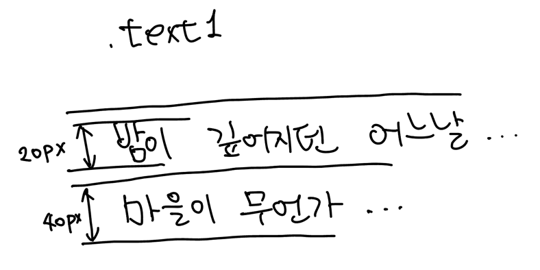

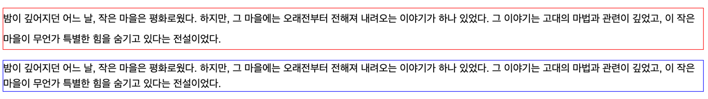

실수 1.5로 설정한 .text2의 경우 폰트 크기 20px을 기준으로 1.5배로 설정되었다.

### 텍스트 정렬 방향 지정하기

text-align이라는 속성을 사용하며 left, right, center, justifiy(양쪽정렬)이 있다.

### 텍스트 자간 지정하기

letter-spacing이란 속성을 사용하며 px로 설정한다.

### 너비와 높이 지정하기

태그 영역의 크기는 width, height 속성을 사용함으로써 정의되며, px, %(부모태그 기준), vw(웹브라우저 너비 기준 백분율), vh(웹브라우저 높이 기준 백분율)을 사용한다.

```html
<body>
    <article>
        width, height 모두 100px로 했을 때
    </article>
    <article>
        width, height 모두 20%로 했을 때
    </article>
    <article>
        width, height 모두 10vw로 했을 때
    </article>
    <article>
        width, height 모두 10vh로 했을 때
    </article>
</body>
```

```css
article {
    border: 1px solid red;
}
article:nth-of-type(1) {
    width: 100px;
    height: 100px;
}
article:nth-of-type(2) {
    width: 20%;
    height: 20%;
}
article:nth-of-type(3) {
    width: 10vw;
    height: 10vw;
}
article:nth-of-type(4) {
    width: 10vh;
    height: 10vh;
}
```


px로 지정하면 웹브라우저 크기가 달라져도 영역 넓이가 변하지 않는 한편, %로 지정하면 웹브라우저 크기가 달라졌을 때 부모 태그인 <body>태그 기준으로 너빗값이 변한다.


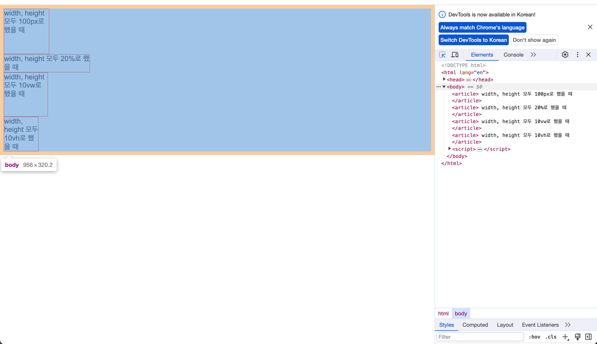

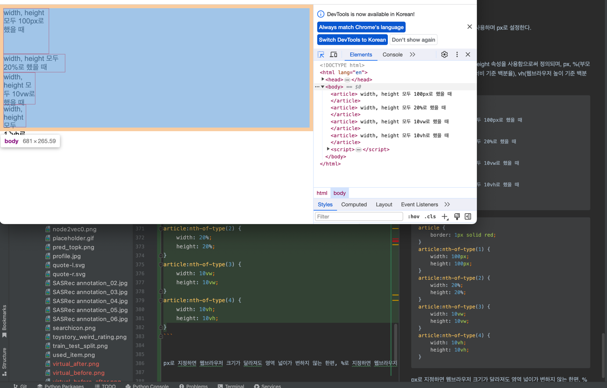

그러나 body태그는 height가 변하지 않는다! 그래서 %를 사용한다면 높이는 변하지 않는다.


### 바깥쪽 여백 지정하기

margin 속성을 사용해 지정한다. px, %(부모 태그 기준), vw(웹브라우저 너비 기준), vh(웹브라우저 높이 기준)을 사용한다.


```html
<body>
    <article>
        margin: 20px (상하좌우)
    </article>
    <article>
        margin: 20px 50px (상하, 좌우)
    </article>
    <article>
        margin: 20px auto (상하, 좌우중앙)
    </article>
    <article>
        margin: 20px auto 40px (상, 좌우중앙, 하)
    </article>
    <article>
        margin: 0px 10px 20px 30px (상, 우, 하, 좌)
    </article>
    <article>
        margin-left: 20px (좌)
    </article>
    <article>
        margin-right: 20px (우)
    </article>
    <article>
        margin-top: 20px (상)
    </article>
    <article>
        margin-bottom: 20px (하)
    </article>
</body>
```

```css
article {
    width: 150px;
    height: 40px;
    border: 1px solid red;
}
article:nth-of-type(1) {
    margin: 20px;
}
article:nth-of-type(2) {
    margin: 20px 50px;
}
article:nth-of-type(3) {
    margin: 20px auto;
}
article:nth-of-type(4) {
    margin: 20px auto 40px;
}
article:nth-of-type(5) {
    margin: 0px 10px 20px 30px;
}
article:nth-of-type(6) {
    margin-left: 20px;
}
article:nth-of-type(7) {
    margin-right: 20px;
}
article:nth-of-type(8) {
    margin-top: 20px;
}
article:nth-of-type(9) {
    margin-bottom: 20px;
}
```

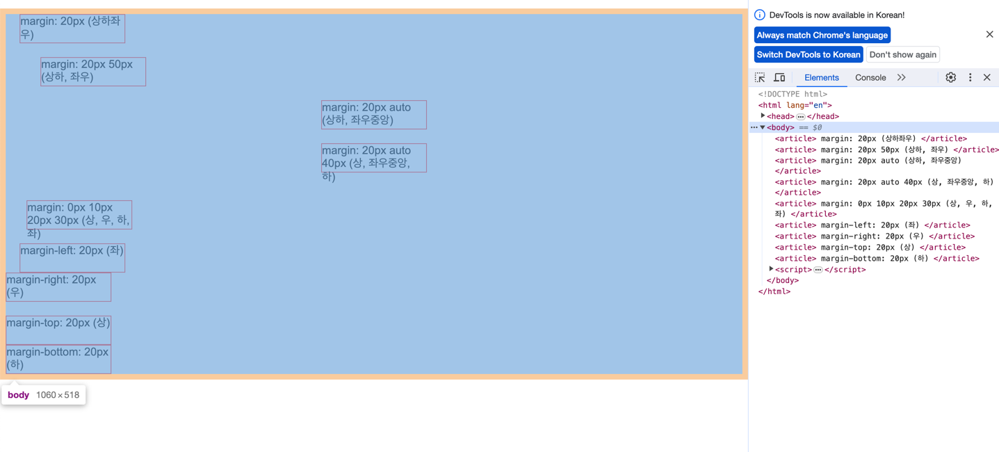

일단 body 영역부터 확인하고 들어가보자.

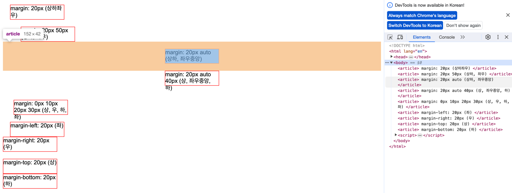

실제론 상하 여백만 지정하고 좌우 여백은 중앙에 배치하도록 하는 방법을 가장 많이 사용한다고 한다.


### 안쪽 여백 지정하기

안쪽 여백은 padding 속성을 사용하며, 사용법은 px, %, vw, vh로 margin과 사용법이 같다.

```html
<body>
    <article>
        box1
    </article>
    <article>
        box2
    </article>
</body>
```

```css
article {
    width: 100px;
    height: 100px;
    border: 1px solid red;
}
article:nth-of-type(1) {
    padding: 0px;
}
article:nth-of-type(2) {
    padding: 30px;
}
```

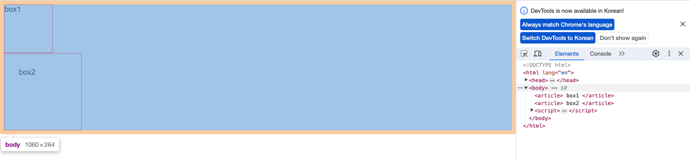

body 영역부터 확인해보자.


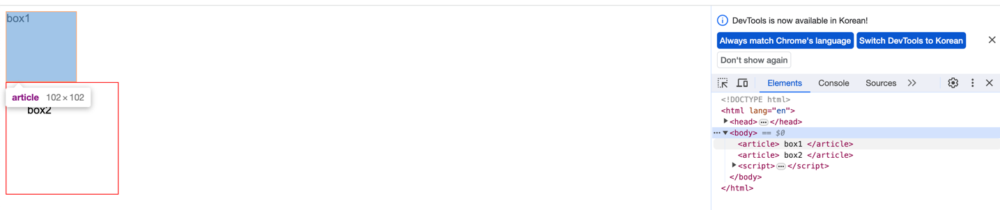

일단 box1과 box2는 동일하게 width 100, height 100이다.

box1은 안쪽여백(padding)을 0으로 줬기 때문에 box1이라는 텍스트가 박스 가장자리에 붙어있다.

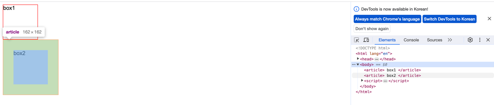

그런데 box2는 안쪽여백에 30px을 주었기 때문에 box2라는 텍스트가 여백 안쪽에 위치한다. 박스 크기가 커진 것이다. 이처럼 padding은 기존 요소 크기에 안쪽 여백을 추가해준다. 결과적으로 box2의 너빗값과 높잇값은 160px이 된다.


그럼 기존 박스 크기는 유지하고 안쪽 여백만 있게 하려면? width와 height를 새로 작게 지정해줘서 padding까지 더한 값이 100이 되게 만들수도 있다.
하지만 box-sizing 속성을 이용하면 기존 너빗값과 높잇값을 자동으로 포함시킬 수 있다.

```css
article {
    width: 100px;
    height: 100px;
    border: 1px solid red;
}
article:nth-of-type(1) {
    padding: 0px;
}
article:nth-of-type(2) {
    padding: 30px;
    box-sizing: border-box;
}
```
box-sizing: border-box 속성만 추가하면 기존 박스 크기를 유지하면서 여백을 지정할 수 있다.

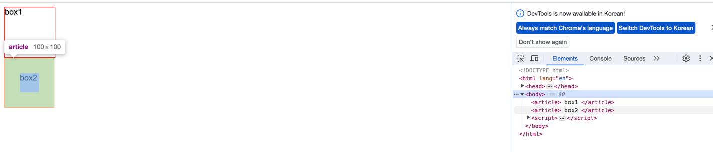

100 x 100은 유지하면서 안쪽 여백인 padding 30px이 추가됐다.


### 블록 요소와 인라인 요소 태그

태그의 크기 및 테두리 등을 지정할 때는 해당 태그가 블록 요소인지 인라인 요소인지에 따라 다르게 적용된다.

블록 요소 : 웹페이지 영역을 구분하는 레이아웃과 관련된다. h1~h6, p, ol, ul, dl, div, header, footer, section, article, aside, nav 등. 줄을 자동으로 바꾼다. 넓이와 높이를 지정할 수 있다. 너비를 지정하지 않을 시 부모의 너빗값을 100% 상속받는다. 블록요소와 인라인요소 모두 묶을 수 있다.

인라인 요소 : 글의 서식과 관련된다. strong, em, a, span 등. 자동 줄바꿈 X, 옆으로 나열된다. 너비와 높이를 지정할 수 없다. 텍스트의 크기 자체가 해당 요소의 크기가 된다. 인라인 요소만 묶을 수 있다.


```html
<body>
    <p>
        블록 요소 태그는 자동 줄 바꿈 됩니다. 현재 이 글은 p 태그입니다.
    </p>
    <p>
        <span>
            <strong>인라인 요소 태그</strong>들은 <em>좌우로</em> 배치됩니다.
        </span>
    </p>
</body>
```

```css
p {
    border: 1px solid red;
}
strong, em {
    border: 1px solid blue;
}
```

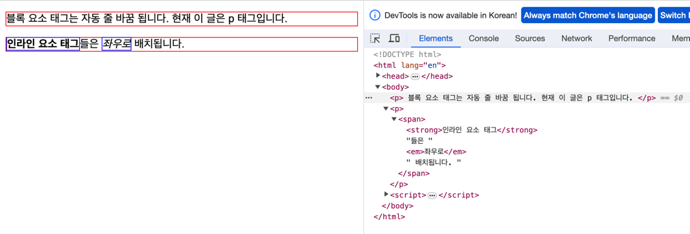

블록 요소인 p태그에 width와 height를 설정하지 않아서 부모태그인 body태그의 width와 height를 상속받았다. 그리고 빨간색 테두리를 갖고있으며, 자기들 p태그끼리 자동 줄바꿈이 됐다. 반면 인라인 요소인 strong과 em태그는 줄바꿈되지 않았다. 그리고 border를 보면 딱 텍스트만큼만 생긴걸 알 수 있다.

블록요소와 인라인 요소의 크기를 지정해보자.

```css
p {
    border: 1px solid red;
    height: 100px;
}
strong, em {
    border: 1px solid blue;
    height: 50px;
}
```
각각 height를 100px, 50px씩 지정해보았다.

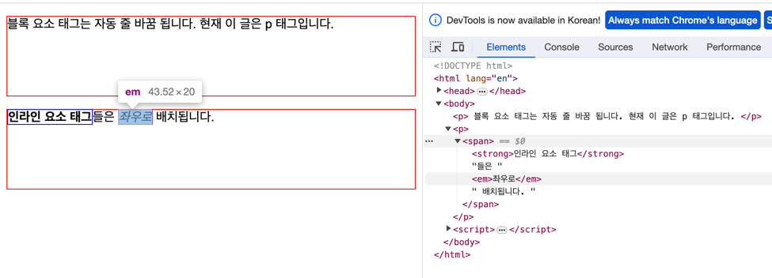

p태그는 height가 제대로 적용되어 빨간색 박스의 높이가 커졌다. 그런데 strong, em태그에는 적용되지 않았다.

하지만 강제로 적용해야 할때는 display: inline-block이라는 속성을 추가하여 인라인, 블록 요소의 속성을 모두 사용하겠다고 하면 된다.

```css
p {
    border: 1px solid red;
    height: 100px;
}
strong, em {
    border: 1px solid blue;
    height: 50px;
    display: inline-block;
}
```

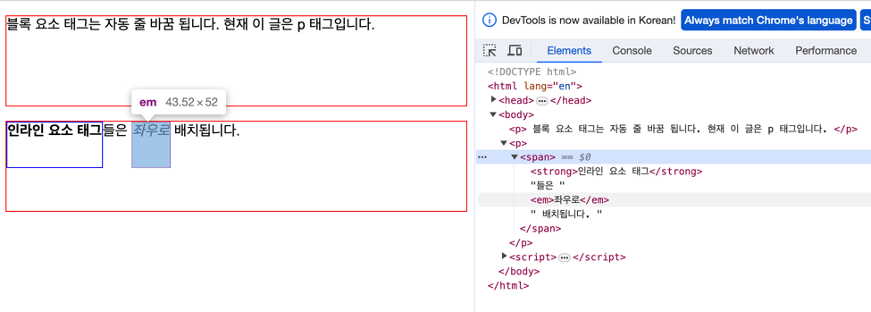

strong, em태그에도 height가 적용되었다. 

인라인을 블록 요소로 강제 변환도 가능하다. display: block을 쓰면 된다. 만약 위의 strong, em태그에 이 display: block를 쓰면 어떻게 될까? 아마 height값이 적용될거고, 자동 줄바꿈이 될거고, 크기는 텍스트 크기가 아니라 body의 width와 height를 상속받을 것이다.


```css
p {
    border: 1px solid red;
    height: 100px;
}
strong, em {
    border: 1px solid blue;
    height: 50px;
    display: block;
}
```
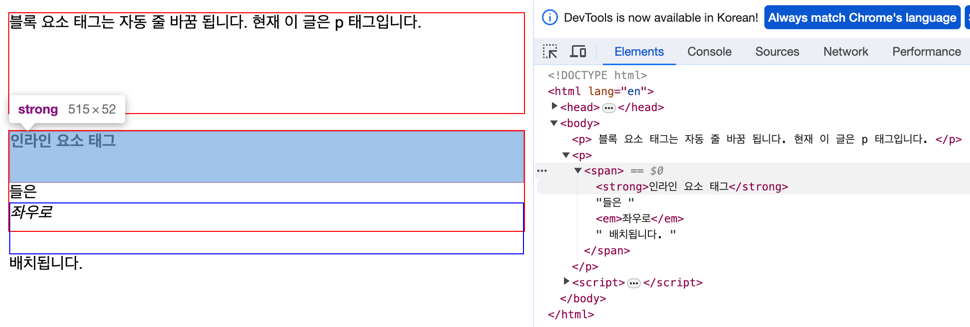

심지어 '좌우로'의 em태그 크기는 두 번째 p태그를 넘어버렸다.


