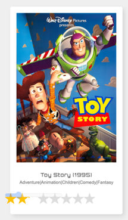

추천시스템 페이지를 만드는 중 별점이 이상하게 표시되는 현상이 있었다... 책 Do it! 인터랙티브 웹 페이지 만들기에 나오는 템플릿 그대로 사용하다보니 이런 문제가 생겨도 해결하지 못하여 CSS 완전 쌩기초부터
정리해보려한다.



위 사진의 html코드는 다음과 같다.

```html

<body>
<main>
    <section>
        
        <article class='pop'>
            <div>
                
                <h2>{{ r.title }}</h2>
                <p>{{ r.genres }}</p>
                ★★★★★
                <span class="rating_star">★★★★★</span>
                <input type="range" value="1" step="1" min="0" max="10">
            </div>
        </article>
        
    </section>
</main>
</body>
```

배경이 되는 회색 별은 <p>태그 바로 아래의 별 다섯개이고, 노란색으로 채워지는 별은 span.rating_star태그이다.
CSS 코드를 여기 적기엔 너무 길기 때문에 CSS를 공부하면서 왜 저렇게 되는지 알아보자..

아참 위 html 코드의 출처는 [[JavaScript] 별점 드래그 기능 만들기](https://stickode.tistory.com/639)이다. (감사합니다ㅠ)


---

### 전체 선택자

```css
* {
    border: 1px solid red;
}
```
body 태그를 포함해 태그 전체를 선택할 수 있다.

### 태그 선택자
특정 태그를 선택한다.

```css
h1 {
    border: 1px solid red;
}
h2 {
    border: 1px solid blue;
}
```


### 자손 선택자
자식과 하위요소를 포함해 그 하위에 있는 모든 요소를 선택한다.
```css
p strong {
    border: 1px solid blue;
}
```


### 자식 선택자
직계 자식요소만 선택한다.
```css
ul > li {
    border: 1px solid blue;
}
```
